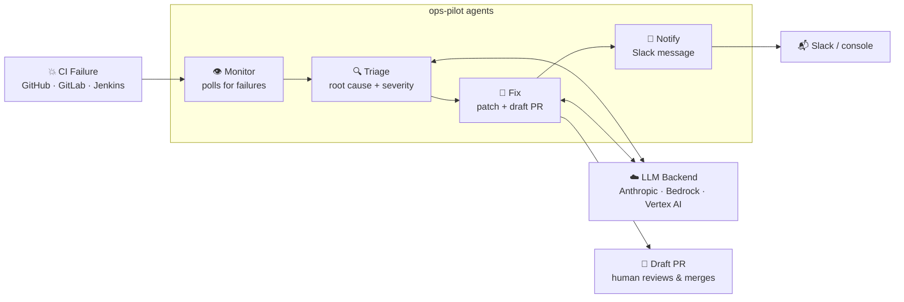

# ⚡ ops-pilot

**AI agents that watch your CI/CD pipelines, diagnose failures, write the fix, and open a pull request — while your engineers sleep.**

[](https://github.com/adnanafik/ops-pilot/actions)
[](https://www.python.org)
[](LICENSE)

---

## 🎮 Live Demo

**[→ Try it now: adnanafik.github.io/ops-pilot](https://adnanafik.github.io/ops-pilot/)**

> Click a scenario, watch four AI agents light up in sequence, and see the generated PR and Slack message appear — no sign-up, no API key, runs entirely in your browser.


---

## What problem does this solve?

When a CI pipeline breaks at 2 AM, an engineer gets paged. They dig through logs, find the root cause, write a fix, open a PR, and notify the team. That cycle takes 30–90 minutes even for experienced engineers — and it's mostly mechanical work.

**ops-pilot automates the mechanical part:**

- 🔍 **Detects** the failure and pulls the relevant logs
- 🧠 **Diagnoses** the root cause using Claude (severity, affected service, confidence)
- 🔧 **Writes a fix**, commits it to a branch, and opens a draft PR for human review
- 📣 **Notifies** your team on Slack with a concise summary

Engineers still review and merge. ops-pilot handles the 2 AM triage.

---

## Quickstart

**Try the demo in 3 commands — no API key needed:**

```bash
git clone https://github.com/adnanafik/ops-pilot && cd ops-pilot
docker compose up ops-pilot-demo
open http://localhost:8000
```

**Run against your real pipelines:**

```bash
cp .env.example .env        # add ANTHROPIC_API_KEY + GITHUB_TOKEN
pip install -e ".[dev]"
python3 scripts/watch_and_fix.py --once --dry-run   # triage only, no PRs opened
```

**Configure your repos in `ops-pilot.yml`:**

```yaml
anthropic_api_key: ${ANTHROPIC_API_KEY}
github_token: ${GITHUB_TOKEN}
slack_bot_token: ${SLACK_BOT_TOKEN}

pipelines:
  - repo: myorg/backend
    slack_channel: "#platform-alerts"
    severity_threshold: medium    # skip low-severity noise

  - repo: myorg/payments
    provider: gitlab_ci           # GitHub Actions, GitLab CI, or Jenkins
    slack_channel: "#payments-oncall"
    severity_threshold: high
```

---

## How it works



### The 30-second version

| Step | Agent | What it does |
|------|-------|-------------|
| 1 | **Monitor** | Polls GitHub Actions / GitLab CI / Jenkins every 30s. Finds new failed runs, fetches log output. |
| 2 | **Triage** | Sends logs + diff to Claude. Gets back: root cause, severity (LOW→CRITICAL), affected service, fix confidence. |
| 3 | **Fix** | Asks Claude which files to change and how. Commits the patch to `ops-pilot/fix-<sha>`, opens a **draft** PR. Nothing merges without a human. |
| 4 | **Notify** | Posts a one-paragraph Slack summary: what broke, why, and a link to the PR. Falls back to console output in dev mode. |

**Deduplication:** ops-pilot uses open GitHub/GitLab PRs as its source of truth. If a PR for a commit already exists, it waits — it will never spam your repo with duplicate PRs, even after a crash or redeploy.

---

## Architecture

```
ops-pilot/
├── agents/
│   ├── base_agent.py        ← Abstract base: run(), describe(), injected LLM backend
│   ├── monitor_agent.py     ← Polls CI provider; returns Failure models
│   ├── triage_agent.py      ← LLM root cause analysis; returns Triage model
│   ├── fix_agent.py         ← LLM patch generation + PR via CI provider
│   └── notify_agent.py      ← Slack / webhook / console notification
├── providers/
│   ├── base.py              ← CIProvider ABC (7 methods: get_failures, open_draft_pr, …)
│   ├── github.py            ← GitHub Actions implementation
│   ├── gitlab.py            ← GitLab CI implementation
│   ├── jenkins.py           ← Jenkins implementation (delegates git ops to GitHub/GitLab)
│   └── factory.py           ← make_provider(pipeline, cfg) — wires config to provider
├── shared/
│   ├── models.py            ← Pydantic models: Failure → Triage → Fix → Alert
│   ├── config.py            ← YAML config + env-var substitution + validation
│   ├── llm_backend.py       ← LLMBackend Protocol + Anthropic / Bedrock / Vertex backends
│   ├── task_queue.py        ← File-locked task queue (atomic rename, no broker needed)
│   └── state_store.py       ← JSON state (dedup across restarts)
├── demo/
│   ├── app.py               ← FastAPI SSE server for local demo
│   ├── scenarios/           ← 3 pre-recorded realistic failure scenarios (JSON)
│   └── static/index.html    ← Single-file demo UI — vanilla JS, no build step
├── docs/
│   ├── index.html           ← GitHub Pages static demo (no server, pure JS)
│   ├── demo.gif             ← Animated walkthrough embedded in README
│   └── scenarios/           ← Scenario JSON files served statically
├── tests/
│   ├── conftest.py          ← Shared fixtures (sample_failure, mock_backend, …)
│   ├── test_triage_agent.py
│   ├── test_fix_agent.py
│   ├── test_notify_agent.py
│   ├── test_monitor_agent.py
│   ├── test_llm_client.py
│   ├── test_state_store.py
│   ├── test_task_queue.py
│   └── fixtures/            ← Sample CI log files
├── .claude/commands/        ← 5 Claude Code slash commands (see below)
├── scripts/
│   └── watch_and_fix.py     ← Production entry point (continuous watcher)
├── run_pipeline.py          ← One-shot live runner for manual testing
├── ops-pilot.example.yml    ← Fully documented config template
├── Dockerfile
└── docker-compose.yml       ← demo UI + optional watcher service
```

Every agent communicates exclusively through typed Pydantic models — no raw dicts cross boundaries. Every agent is independently testable with a mock backend.

---

## LLM backends

ops-pilot works with any of the three — switch by changing one config line:

| Backend | Config | Auth |
|---------|--------|------|
| **Anthropic API** (default) | `llm_provider: anthropic` | `ANTHROPIC_API_KEY` |
| **AWS Bedrock** | `llm_provider: bedrock` | IAM role / `AWS_ACCESS_KEY_ID` |
| **Google Vertex AI** | `llm_provider: vertex_ai` | ADC / `GOOGLE_APPLICATION_CREDENTIALS` |

```yaml
# Switch to Bedrock — no agent code changes needed
llm_provider: bedrock
aws_region: us-east-1
model: anthropic.claude-sonnet-4-5-20251001-v1:0
```

---

## Claude Code integration

ops-pilot ships with 5 slash commands for [Claude Code](https://claude.ai/code) in `.claude/commands/`. Open this repo in Claude Code and use them directly — each one reads the actual source files before acting, so it follows the project's exact patterns.

```bash
# Diagnose a CI failure from log output or a description
/triage "auth service null pointer on commit a3f21b7"

# Add a new pipeline — detects provider, validates config, runs Python to confirm
/add-pipeline myorg/my-service provider:github_actions

# Scaffold a full CIProvider implementation (factory + __init__ wired automatically)
/new-provider CircleCI

# Run the watcher — checks .env, shows configured pipelines, then starts
/run once --dry-run

# Generate a new demo scenario JSON from a failure description
/scenario "Redis connection timeout in payment service"
```

Every command is defined in `.claude/commands/<name>.md` — edit the `.md` file to change how Claude approaches the task.

---

## Design decisions

### Why four separate agents instead of one big prompt?

Each agent has one job, one input type, and one output type. TriageAgent can be tested in isolation with a mock backend. FixAgent can be swapped for a different patching strategy. The pipeline is composable — you can run Triage-only (`--dry-run`) without touching the Fix or Notify agents.

### Why file-based task locking?

The task queue uses `os.rename()` for atomic task claiming — a POSIX guarantee that means two workers can never claim the same task without a database or message broker. Zero external dependencies, git-friendly, deployable anywhere. Pattern from the [Anthropic multi-agent systems article](https://www.anthropic.com/research/building-effective-agents).

### Why simulation mode?

Live agentic demos are brittle: API rate limits, flaky network, non-deterministic LLM output. Pre-recorded scenarios replay realistic runs with SSE streaming — the demo always works, loads instantly, and costs nothing to host on GitHub Pages.

### Why draft PRs, not auto-merge?

ops-pilot is a force multiplier, not a replacement for engineering judgment. It opens the PR, writes the description, and notifies the team. A human reviews the diff and merges. This keeps the system useful without making it dangerous.

### Why Pydantic models between agents?

Raw dicts break silently when a key is missing. Pydantic validates at construction time, generates JSON Schema for tool-use prompts, and makes the data contract between agents explicit and type-checked.

---

## Running tests

```bash
pip install -e ".[dev]"
pytest                      # 89 tests, 82% coverage
pytest -k triage            # single agent
ruff check agents/ shared/  # linting
```

---

## License

MIT © 2026 — built as a portfolio project demonstrating production-quality multi-agent AI systems.
