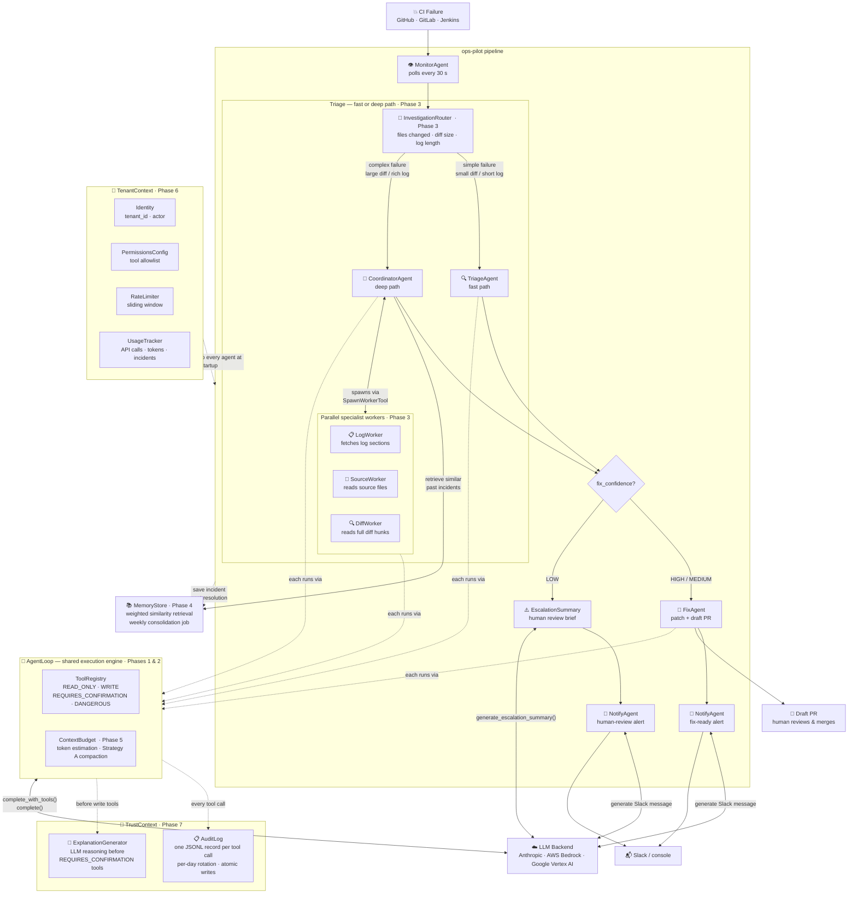

# ⚡ ops-pilot

**AI agents that watch your CI/CD pipelines, diagnose failures, write the fix, and open a pull request — while your engineers sleep.**

[](https://github.com/adnanafik/ops-pilot/actions)
[](https://www.python.org)
[](LICENSE)

---

## 🎮 Live Demo

**[→ Try it now: adnanafik.github.io/ops-pilot](https://adnanafik.github.io/ops-pilot/)**

> Click a scenario, watch four AI agents light up in sequence, and see the generated PR and Slack message appear — no sign-up, no API key, runs entirely in your browser.


---

## What problem does this solve?

When a CI pipeline breaks at 2 AM, an engineer gets paged. They dig through logs, find the root cause, write a fix, open a PR, and notify the team. That cycle takes 30–90 minutes even for experienced engineers — and it's mostly mechanical work.

**ops-pilot automates the mechanical part:**

- 🔍 **Detects** the failure and pulls the relevant logs
- 🧠 **Diagnoses** the root cause using Claude (severity, affected service, confidence)
- 🔧 **Writes a fix**, commits it to a branch, and opens a draft PR for human review
- 📣 **Notifies** your team on Slack with a concise summary

Engineers still review and merge. ops-pilot handles the 2 AM triage.

---

## Quickstart

**Try the demo in 3 commands — no API key needed:**

```bash
git clone https://github.com/adnanafik/ops-pilot && cd ops-pilot
docker compose up ops-pilot-demo
open http://localhost:8000
```

**Run against your real pipelines (no local Python needed):**

```bash
cp .env.example .env        # add ANTHROPIC_API_KEY + GITHUB_TOKEN
# edit ops-pilot.yml — add your repos under pipelines:
docker compose --profile watcher run --rm ops-pilot-watcher \
  python3 scripts/watch_and_fix.py --once --dry-run   # triage only, no PRs opened
docker compose --profile watcher run --rm ops-pilot-watcher \
  python3 scripts/watch_and_fix.py --once              # full run — opens draft PRs
```

**Configure your repos in `ops-pilot.yml`:**

```yaml
anthropic_api_key: ${ANTHROPIC_API_KEY}
github_token: ${GITHUB_TOKEN}
slack_bot_token: ${SLACK_BOT_TOKEN}

pipelines:
  - repo: myorg/backend
    slack_channel: "#platform-alerts"
    severity_threshold: medium    # skip low-severity noise

  - repo: myorg/payments
    provider: gitlab_ci           # GitHub Actions, GitLab CI, or Jenkins
    slack_channel: "#payments-oncall"
    severity_threshold: high
```

---

## How it works



### The 30-second version

| Step | Agent | What it does |
|------|-------|-------------|
| 1 | **Monitor** | Polls GitHub Actions / GitLab CI / Jenkins every 30s. Finds new failed runs, fetches log output. |
| 2 | **Triage** | Runs an agentic tool-use loop: reads source files, fetches earlier log sections, diffs commits — until it has enough signal to conclude. Returns root cause, severity (LOW→CRITICAL), affected service, and fix confidence. |
| 3 | **Fix or Escalate** | If confidence is MEDIUM or HIGH: commits a patch and opens a draft PR. If confidence is LOW: generates an escalation summary (what was investigated, what was inconclusive, recommended next step) — no PR is opened; a human is required. |
| 4 | **Notify** | Posts a one-paragraph Slack summary: fix-ready alert with PR link, or escalation alert requesting human review. Falls back to console in dev mode. |

Every tool call (file reads, commits, PR opens) is written to a structured JSONL audit log. Destructive tools (`update_file`, `open_draft_pr`) get a pre-action LLM explanation generated before execution — observable without blocking.

**Deduplication:** ops-pilot uses open GitHub/GitLab PRs as its source of truth. If a PR for a commit already exists, it waits — it will never spam your repo with duplicate PRs, even after a crash or redeploy.

---

## Architecture

```
ops-pilot/
├── agents/
│   ├── base_agent.py           ← Abstract base: run(), describe(), injected LLM backend
│   ├── monitor_agent.py        ← Polls CI provider; returns Failure models
│   ├── triage_agent.py         ← Fast path: single agentic loop; returns Triage
│   ├── coordinator_agent.py    ← Deep path: spawns parallel workers; returns Triage
│   ├── investigation_router.py ← Routes failures to fast or deep path (heuristic)
│   ├── fix_agent.py            ← LLM patch generation + PR via CI provider
│   ├── notify_agent.py         ← Slack / webhook / console notification
│   └── tools/
│       ├── triage_tools.py     ← GetFileTool, GetMoreLogTool, GetCommitDiffTool (READ_ONLY)
│       ├── fix_tools.py        ← GetRepoTreeTool, CreateBranchTool (WRITE); UpdateFileTool, OpenDraftPRTool (REQUIRES_CONFIRMATION)
│       └── coordinator_tools.py ← SpawnWorkerTool + LogWorker / SourceWorker / DiffWorker
├── providers/
│   ├── base.py              ← CIProvider ABC (7 methods: get_failures, open_draft_pr, …)
│   ├── github.py            ← GitHub Actions implementation
│   ├── gitlab.py            ← GitLab CI implementation
│   ├── jenkins.py           ← Jenkins implementation (delegates git ops to GitHub/GitLab)
│   └── factory.py           ← make_provider(pipeline, cfg) — wires config to provider
├── shared/
│   ├── models.py            ← Pydantic models: Failure → Triage → Fix → Alert → MemoryRecord
│   ├── agent_loop.py        ← Generic AgentLoop[T]: tool-use loop + Tool ABC + ToolContext + confirm hook
│   ├── tool_registry.py     ← ToolRegistry: permission-tier watermark (READ_ONLY ≤ WRITE ≤ DANGEROUS ≤ REQUIRES_CONFIRMATION)
│   ├── context_budget.py    ← ContextBudget: token estimation + Strategy A compaction
│   ├── memory_store.py      ← MemoryStore: append + weighted similarity retrieval (no external deps)
│   ├── config.py            ← YAML config + env-var substitution + Pydantic validation (TrustConfig, RateLimitsConfig, PermissionsConfig)
│   ├── llm_backend.py       ← LLMBackend Protocol + Anthropic / Bedrock / Vertex backends
│   ├── task_queue.py        ← File-locked task queue (atomic rename, no broker needed)
│   ├── state_store.py       ← JSON state (dedup across restarts)
│   ├── tenant_context.py    ← TenantContext: per-deployment identity, usage tracker, tool permissions
│   ├── rate_limiter.py      ← RateLimiter: sliding-window API call + token limits per tenant
│   ├── usage_tracker.py     ← UsageTracker: per-tenant API call / token / incident counters
│   ├── audit_log.py         ← AuditLog: one JSONL record per tool call, per-day rotation, atomic writes
│   ├── explanation_gen.py   ← ExplanationGenerator: pre-action LLM explanation for REQUIRES_CONFIRMATION tools
│   ├── escalation.py        ← EscalationSummary + generate_escalation_summary (LOW-confidence path)
│   └── trust_context.py     ← TrustContext dataclass + make_trust_context factory
├── demo/
│   ├── app.py               ← FastAPI SSE server for local demo
│   ├── scenarios/           ← 3 pre-recorded realistic failure scenarios (JSON)
│   └── static/index.html    ← Single-file demo UI — vanilla JS, no build step
├── docs/
│   ├── index.html           ← GitHub Pages static demo (no server, pure JS)
│   ├── demo.gif             ← Animated walkthrough embedded in README
│   └── scenarios/           ← Scenario JSON files served statically
├── tests/
│   ├── conftest.py                 ← Shared fixtures (sample_failure, mock_backend, …)
│   ├── test_triage_agent.py
│   ├── test_coordinator_agent.py
│   ├── test_investigation_router.py
│   ├── test_memory_store.py
│   ├── test_fix_agent.py
│   ├── test_fix_tools.py
│   ├── test_notify_agent.py
│   ├── test_monitor_agent.py
│   ├── test_llm_client.py
│   ├── test_state_store.py
│   ├── test_task_queue.py
│   ├── test_agent_loop.py          ← AgentLoop + TrustContext integration tests
│   ├── test_audit_log.py
│   ├── test_explanation_gen.py
│   ├── test_escalation.py
│   ├── test_trust_context.py
│   ├── test_tenant_context.py
│   ├── test_rate_limiter.py
│   └── fixtures/                   ← Sample CI log files
├── .claude/commands/        ← 5 Claude Code slash commands (see below)
├── memory/                  ← Incident memory (created at runtime)
│   ├── incidents/           ← One JSON file per incident
│   └── index.json           ← Scoring metadata for similarity retrieval
├── scripts/
│   ├── watch_and_fix.py     ← Production entry point (continuous watcher)
│   └── consolidate_memory.py ← Weekly job: extract durable fix patterns from incident groups
├── run_pipeline.py          ← One-shot live runner for manual testing
├── ops-pilot.example.yml    ← Fully documented config template
├── Dockerfile
└── docker-compose.yml       ← demo UI + optional watcher service
```

Every agent communicates exclusively through typed Pydantic models — no raw dicts cross boundaries. Every agent is independently testable with a mock backend.

---

## LLM backends

ops-pilot works with any of the three — switch by changing one config line:

| Backend | Config | Auth |
|---------|--------|------|
| **Anthropic API** (default) | `llm_provider: anthropic` | `ANTHROPIC_API_KEY` |
| **AWS Bedrock** | `llm_provider: bedrock` | IAM role / `AWS_ACCESS_KEY_ID` |
| **Google Vertex AI** | `llm_provider: vertex_ai` | ADC / `GOOGLE_APPLICATION_CREDENTIALS` |

```yaml
# Switch to Bedrock — no agent code changes needed
llm_provider: bedrock
aws_region: us-east-1
model: anthropic.claude-sonnet-4-5-20251001-v1:0
```

---

## Claude Code integration

ops-pilot ships with 5 slash commands for [Claude Code](https://claude.ai/code) in `.claude/commands/`. Open this repo in Claude Code and use them directly — each one reads the actual source files before acting, so it follows the project's exact patterns.

```bash
# Diagnose a CI failure from log output or a description
/triage "auth service null pointer on commit a3f21b7"

# Add a new pipeline — detects provider, validates config, runs Python to confirm
/add-pipeline myorg/my-service provider:github_actions

# Scaffold a full CIProvider implementation (factory + __init__ wired automatically)
/new-provider CircleCI

# Run the watcher — checks .env, shows configured pipelines, then starts
/run once --dry-run

# Generate a new demo scenario JSON from a failure description
/scenario "Redis connection timeout in payment service"
```

Every command is defined in `.claude/commands/<name>.md` — edit the `.md` file to change how Claude approaches the task.

---

## Design decisions

### Why four separate agents instead of one big prompt?

Each agent has one job, one input type, and one output type. TriageAgent can be tested in isolation with a mock backend. FixAgent can be swapped for a different patching strategy. The pipeline is composable — you can run Triage-only (`--dry-run`) without touching the Fix or Notify agents.

### Why file-based task locking?

The task queue uses `os.rename()` for atomic task claiming — a POSIX guarantee that means two workers can never claim the same task without a database or message broker. Zero external dependencies, git-friendly, deployable anywhere. Pattern from the [Anthropic multi-agent systems article](https://www.anthropic.com/research/building-effective-agents).

### Why simulation mode?

Live agentic demos are brittle: API rate limits, flaky network, non-deterministic LLM output. Pre-recorded scenarios replay realistic runs with SSE streaming — the demo always works, loads instantly, and costs nothing to host on GitHub Pages.

### Why a tool-use loop in Triage instead of a single prompt?

The original TriageAgent sent one prompt and hoped the answer was in the last 50 log lines. Real failures often aren't: the root cause is 100 lines above the tail, in the source file at the failing line, or in the actual diff hunks (not a summary of which files changed).

`AgentLoop` lets the model request exactly what it needs — `get_file`, `get_more_log`, `get_commit_diff` — and stop when it has enough signal. If it hits the turn limit before concluding, it escalates with partial findings rather than opening a PR based on a guess. A wrong fix is more expensive than a missed fix: it creates a PR engineers have to triage, and it erodes trust in the system.

### Why a router instead of one agent that decides its own strategy?

The routing decision (fast vs. deep) is now a visible, logged record: "this failure was routed to deep investigation because 4 files changed." If it's hidden inside an agent's system prompt, engineers can't inspect or tune it without reading LLM outputs.

`InvestigationRouter` routes heuristically (file count, diff size, log length) in Phase 3. In Phase 4, it can be upgraded to LLM-based classification backed by incident memory — the interface (`route() → 'fast' | 'deep'`) stays the same.

### Why are coordinator workers isolated from each other?

Each worker (`log_worker`, `source_worker`, `diff_worker`) runs in its own `AgentLoop` with its own message history and a scoped tool list. `log_worker` cannot read source files; `diff_worker` cannot fetch logs. Two benefits: (1) workers stay focused and don't spend their context budget on tangents; (2) the coordinator sees only clean summaries, not raw tool output from 9 concurrent tool calls.

Workers cannot spawn further workers — no `SpawnWorkerTool` in their tool list. This prevents unbounded recursion and keeps the depth predictable.

### Why a tool registry instead of passing tool lists directly?

`TriageAgent` used to hardcode `[GetFileTool(), GetMoreLogTool(), GetCommitDiffTool()]`. That worked, but the safety guarantee ("triage never gets write tools") lived only in the developer's head.

`ToolRegistry.get_tools(max_permission=READ_ONLY)` makes the blast-radius ceiling structural — TriageAgent declares its ceiling at construction time and the registry enforces it. Adding a new write tool to the catalog doesn't automatically make it available to triage; the agent has to explicitly raise its ceiling. `REQUIRES_CONFIRMATION` tools are excluded from all watermark queries and additionally gated at execution time by a `confirm` hook — no hook wired means the tool is always denied (fail-safe, not fail-open).

### Why structured weighted similarity instead of embeddings?

Embedding-based similarity requires either an external API (Anthropic has no embeddings endpoint) or a heavy dependency like `sentence-transformers` (adds PyTorch to the image). Both break the "zero broker" story.

The alternative — structured weighted similarity over typed Triage fields — is actually better for this domain:

```
score = (
    1.0 × exact_match(failure_type)     # "pytest / test-auth" is high-signal
    + 0.6 × exact_match(affected_service) # same service = same codebase area
    + 0.4 × token_jaccard(root_cause)    # similar error vocabulary
) / 2.0   → normalized [0, 1]
```

When a customer asks "why did it pull that old incident?", you can point at the weights rather than explaining a vector space. Root cause tokens are precomputed at write time — query-time is a tight loop with no LLM calls, no IDF corpus, no external deps.

The tradeoff: no semantic similarity ("OOM killed" vs "heap exhaustion"). At ops-pilot scale — hundreds of incidents, constrained vocabulary — token overlap performs close to embeddings in practice.

### Why does memory retrieval live in CoordinatorAgent, not InvestigationRouter?

Memory retrieval before a fast-path triage would be wasted: simple failures don't need historical context. Deep investigations do.

The coordinator already decides what workers to spawn and what brief to give them. Retrieving prior incidents before spawning lets that context flow into both the spawning decision and the task brief passed to each worker. The retrieval is also visible in the coordinator's initial message — auditable in Phase 7's structured log, not hidden in a system prompt.

### Why does `ContextBudget` live outside `AgentLoop`, and why is it opt-in?

`AgentLoop` is a generic execution engine — it shouldn't know what model it's running on or what its context limit is. Those are operational concerns owned by the entry point that constructs the agents. `ContextBudget` is injected at construction time; `AgentLoop` just calls `should_compact` and `compact` without knowing how either works.

`context_budget=None` means "no budgeting" — existing call sites (tests, demo mode) are unchanged. New operational deployments in `watch_and_fix.py` wire in a budget sized for the model in use. The pattern is the same as `memory_store` on `CoordinatorAgent`: capabilities are opt-in, not forced on every caller.

### Why `chars // 4` and not the Anthropic token-counting API?

Token counting is for triggering a compaction decision, not for billing. The heuristic `len(all_chars) // 4` is conservative — it tends to underestimate for code and log content — so triggering at 75% of the limit absorbs the error. The Anthropic counting endpoint adds a network round-trip before every inference call, which is the wrong trade on an already-hot path. More importantly, adding a counting method to `LLMBackend` would force all three backends (Anthropic, Bedrock, Vertex) and all test mocks to implement it — a maintenance tax for an internal loop concern.

### Why Strategy A (replace tool_result bodies) and not full-history summarization?

By the time compaction triggers, the model has already interpreted each tool result in its subsequent assistant turn. The interpretation is load-bearing; the raw source data isn't:

```
turn N:   tool_result  → [200 lines of raw CI log]
turn N+1: assistant    → "NPE at TokenService.validate() line 42"
```

Replacing the raw log with a stub loses nothing the model doesn't already have. Full-history summarization (Strategy B) would cost an extra LLM call on a context-stressed path, and the model summarizing its own reasoning can drop details that become relevant two turns later. Strategy B can slot in later by implementing the same `compact()` interface — the architecture supports it without changing `AgentLoop`.

### Why per-deployment isolation instead of a runtime tenant switcher?

`TenantContext` is constructed once at startup from the config file and injected into every agent. This means the deployment model is "one config file = one customer" — isolated processes, isolated state, isolated usage tracking. A bug in Customer A's pipeline cannot reach Customer B's memory or rate limit counters.

The alternative — a shared process with a `tenant_id` routing key — would require every data store (memory, state, audit log) to be partitioned by tenant ID, and every agent to filter carefully. One missed filter = data leak. For an agentic system that writes files and opens PRs, the blast radius of a data-routing mistake is unacceptably high. Process isolation is boring and correct.

### Why is `RateLimiter` a sliding window, not a fixed bucket?

A fixed 1-hour bucket resets on the clock: a deployment could use its entire hourly quota in the last 10 minutes of the hour, then the full quota again in the first 10 minutes of the next — 200% in 20 minutes with no rate limit applied. A sliding window (per-call timestamps in a deque) means "at most N calls in any 60-minute window," which is what operators actually want when they say "1000 calls per hour."

### Why a structured JSONL audit log instead of application logs?

Application logs are for debugging; audit logs are for accountability. The difference: application logs are prose consumed by developers after a crash. Audit logs are structured records consumed by compliance tooling, dashboards, and incident reviewers after a breach or unexpected action.

JSONL (one JSON object per line) makes the audit trail grep-friendly and ingestible by any log pipeline (CloudWatch, Datadog, Splunk) without a parser. Rotating by day (`audit/YYYY-MM-DD.jsonl`) bounds file size and maps naturally to retention policies ("keep 90 days"). Atomic writes (`mkstemp` + `rename`) prevent partial records if the process dies mid-write.

### Why does `REQUIRES_CONFIRMATION` auto-proceed when `TrustContext` is present?

Phase 7 is an *observability layer*, not an approval gate. The pre-action explanation is generated so that the audit log contains a human-readable record of *why* the agent decided to commit a file or open a PR — not to block the action waiting for a human click.

Blocking confirmation (`Phase 8`) changes the system from "AI takes action, humans can audit" to "AI proposes action, human approves before execution." That's a fundamentally different product (and deployment model). Phase 7 establishes the explanation infrastructure that Phase 8 will reuse — the `confirm` hook in `AgentLoop` is already the extension point for that upgrade.

### Why generate an escalation summary instead of returning LOW-confidence triage directly?

A LOW-confidence `Triage` says "I'm not sure." An `EscalationSummary` says "here's what I investigated, here's what I couldn't pin down, and here's what you should do next." That's the difference between an alert that pages an engineer at 2 AM and makes them dig through the same evidence the agent already processed, versus an alert that hands off a structured investigation brief.

The escalation summary is also what gets sent to Slack — engineers see a purpose-built "human review required" message, not a raw Triage object with `fix_confidence: LOW` that requires them to know what that field means.

### Why draft PRs, not auto-merge?

ops-pilot is a force multiplier, not a replacement for engineering judgment. It opens the PR, writes the description, and notifies the team. A human reviews the diff and merges. This keeps the system useful without making it dangerous.

### Why Pydantic models between agents?

Raw dicts break silently when a key is missing. Pydantic validates at construction time, generates JSON Schema for tool-use prompts, and makes the data contract between agents explicit and type-checked.

---

## Running tests

No local Python install required — runs inside Docker:

```bash
docker compose run --rm test                  # 335 tests
docker compose run --rm test pytest -k triage # single agent
docker compose run --rm test ruff check agents/ shared/
```

Or locally if you have Python 3.11+:

```bash
pip install -e ".[dev]"
pytest
```

---

## License

MIT © 2026 — built as a portfolio project demonstrating production-quality multi-agent AI systems.
